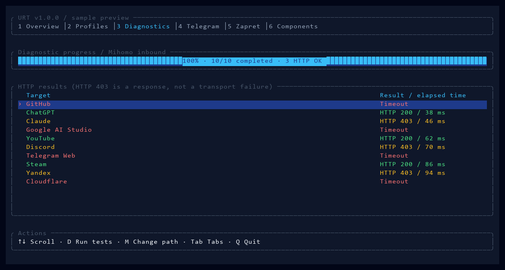

# URTW — Universal Routing Toolset for Windows

[English](README.md) | [Русский](README.ru.md)

[](https://github.com/Oqune/URTW/actions/workflows/build.yml)
[](https://github.com/Oqune/URTW/releases)

The Windows companion to URTA. A Rust/Ratatui dashboard for **Mihomo, sing-box,
Xray, Zapret and TG WS Proxy**, with editable routing standards, client DNS,
private endpoints and independent browser split routing. Opening it reads local
status; networking changes require explicit actions.



*Sample data; normal diagnostics measure requests on demand.*

## First run

1. Download a [portable release](https://github.com/Oqune/URTW/releases),
   [verify its GPG signature](docs/VERIFICATION.md), extract anywhere writable.
2. Run **URTW.bat** or **URTW.exe**. Data defaults to the sibling **data/** folder.
   **Settings → H/K** selects another folder; **--root** overrides it for a launch.
3. On **Cores**, select Mihomo, sing-box or Xray with **Enter**. **I** installs the
   pinned official binary after SHA-256 verification. Installation does not start it.
4. On **Profiles**, **F** accepts a file path (paste supported), **N** opens the
   Windows picker. YAML is for Mihomo, JSON for sing-box/Xray, `.conf` imports WG.
   Selection works before installation and shows **pending** until native validation.
5. Alternatively add an endpoint on **Endpoints**, choose/edit a **Routing**
   standard, edit **Core options**, then press **G** on Profiles to generate a new
   private profile. **V** validates; **S/X** starts/stops the owned selected core.
6. Test the local inbound with **D**. Use **P** on Overview only when you want
   Windows HTTP Proxy, or explicitly enable TUN in supported core options and
   generate/start the new profile from an administrator terminal.

Windows 10/11 x64 and Windows ARM64 builds. Native ARM64 runtime has not been
hardware tested. Zapret/WinDivert is x64 only. TUN and Zapret service management
require administrator access. Do not disconnect an existing working VPN before
installing and validating its replacement. The release has no credentials or
third-party executables; component installation requires working internet.

## Controls

Navigation: **1–9, 0 / F1–F10 / Tab**. Lists: arrows, PgUp/PgDn, Home/End.
**Q/Esc** exits; services keep running. Minimum terminal size **60×18**;
wide terminals use a navigation rail. Forms: paste/type, Tab between fields,
Delete clears a field, Enter saves, Esc cancels. Credentials are masked.

| Screen | Actions |
|---|---|
| Overview | F/N file, S/X selected core, P explicit Windows Proxy, D diagnostics, Y installed legacy tools |
| Profiles | Enter select, V validate, C private editable copy, R rename, Delete remove entry, G generate, O open, L log |
| Diagnostics | D run, M local inbound/system path; HTTP denials count as completed responses |
| Telegram | I install, S/X start/stop, L copy private link, G connect, E port, O upstream settings |
| Zapret | Enter opens original service.bat; I installs once |
| Components | I/Enter installs the selected pinned component |
| Cores | Enter select, E options, I install, A custom adapter, B trusted local binary |
| Endpoints | A share link, W WG file, Enter select, E replace link, R rename, Delete remove |
| Routing | A standard, Enter select, E add rule, U/J reorder, B browser domains, T fallback, R rename, Delete remove, G generate, O PAC |
| Settings | E core options, H/K data folder, O open folder, B private backup, R restore, A toggle core autostart |

Changing selection/options never changes a running profile. Native profiles are
referenced intact; **C** creates an editable private copy. Removing a library entry
retains its file. A different data folder does not move data or stop old processes.
Explicit choices are remembered in **urt-location.json** beside the executable.
Priority: `--root`, `URTW_HOME`, legacy `URT_HOME`, remembered location,
portable `data/`, then `%LOCALAPPDATA%\URTW` without portable.flag.

## Custom routing and endpoints

Endpoints support single-peer WireGuard, SOCKS5, HTTP(S), VLESS and Trojan links,
TCP/WS/gRPC, TLS and REALITY. Unsupported vendor features use native profiles.
Only one endpoint is selected per generated profile; multiple native outbounds,
subscriptions, load balancing and advanced routing remain vendor configuration.
No global Windows DNS or adapter metrics are changed.

Rules: `domain example.com proxy`, `process app.exe direct`,
`ip 192.0.2.0/24 block`. Actions: direct/proxy/block. Generation order:
local network DIRECT → browser proxy domains → ordered rules → chosen fallback.
This allows browser domains to precede a browser process DIRECT rule.
The independent [browser PAC](docs/BROWSER.md) proxies only the selected domains;
its default is DIRECT. Generate after changing browser domains or the local port.
A matching PAC domain does not silently fall back to DIRECT on proxy failure.

| Generated capability | Mihomo | sing-box | Xray |
|---|---|---|---|
| Native profiles / HTTP inbound | YAML / mixed | JSON / mixed | JSON / HTTP |
| WireGuard and listed proxy endpoints | Yes | Yes | Yes |
| Process rules | Yes | Yes | Native extensions only |
| TUN | Yes | Yes | Native external integration only |
| DNS IP / DoH | Yes | Yes | Yes |
| DNS DoT | Yes | Yes | Native profile only |

Per-core ports, DNS, family strategy, IPv6, log level and supported TUN settings
are saved independently. With IPv6 off, generated DNS uses IPv4-only. Family preference is vendor-specific: sing-box supports all four choices; Mihomo uses its native default or IPv4-only, Xray uses both families or IPv4/IPv6-only. Unsupported choices are rejected. Native validation is syntax validation; VPN reachability
needs diagnostics through the actual endpoint. System-path diagnostics disable
HTTP proxy settings in the test client, but can still traverse a running system TUN.

## Extensibility, recovery and ownership

[Custom core adapters](docs/ADAPTERS.md) declare authors, executable, format,
capabilities and direct start/check arguments. Import with A on Cores, install a
trusted local executable with B, then select a native config. No shell command
strings are executed from an adapter. Dependency DLLs belong beside its binary.

Backups contain private endpoint credentials, native profile copies and Telegram
settings, protected by Windows ACLs. Restore requires managed processes stopped,
creates new profile files and preserves originals. Current state is backed up first.
Existing third-party binaries, caches and scheduled tasks are not in backups.
Restore in the same runtime; adapter files must be reimported when moving to a
new runtime. Autostart is an explicit per-runtime Windows task for the selected core;
register it elevated when its profile needs TUN. It does not automatically enable
Windows Proxy, TG or Zapret. Existing external tasks remain untouched.

Processes are owned by exact PID, executable path and creation time. External
processes/listeners are labelled; no broad process-name kills. Windows Proxy has
an ownership-checked restore snapshot. Stopping its owned core restores proxy
settings before stop. If an external/manual Windows Proxy still uses that listener,
stop is refused until you detach it in its original manager or Windows settings.
Secrets are sent to the backend through stdin, never CLI args.
Private data and logs stay out of Git/releases. See [SECURITY.md](SECURITY.md).

Telegram uses the official portable tray app, loopback MTProto and WebSocket
upstream. Advanced DC/Cloudflare/WS controls are in its original tray.
An active external instance is managed there. [Telegram guide](docs/TELEGRAM.md).
Zapret strategies stay in its original service.bat and package lists.

## Development and release

Rust 1.88+, MSVC, Windows PowerShell 5.1, Python and curl. Run:

```powershell
cargo fmt --check
cargo clippy --locked -- -D warnings
cargo test --locked
cargo build --locked
powershell -File scripts/test-engine.ps1 -Integration -Dashboard target/debug/URTW.exe
powershell -File scripts/check-release.ps1
```

CI builds x64/ARM64; signed tags produce drafts. Exact CI archive checksums are
GPG signed locally before publication; no private signing key in CI.
[Contract SemVer](docs/policies/policies.md) follows Impulse's version discipline.

[Authors & licenses](THIRD_PARTY_NOTICES.md) · [Architecture](docs/ARCHITECTURE.md) ·
[Release procedure](docs/RELEASING.md) · [Changelog](CHANGELOG.md) ·
[Compatibility audit](docs/audit/compatibility-v1.1.1.md)
