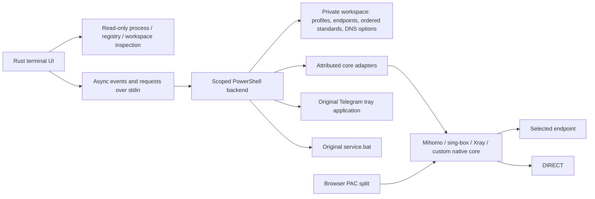

# Architecture

Assets are independent of runtime data. Storage precedence and keys are documented
in README. Discovery and snapshots do not create directories. Explicit folder
selection remembers a path; it does not migrate files or stop processes.
Schema-1 settings.json remains compatible; schema-1 workspace.json adds per-core
profiles, endpoint credentials, standards and DNS. Built-in catalog is public;
custom adapters and installed-path aliases are private. Legacy profiles get stable
legacy-N IDs in both read-only UI migration and the backend's explicit save.

Status uses exact executable, PID and Unix creation time. Windows backend reads
Win32_Process metadata to avoid Process.Path startup races. Ownership is rechecked
before stop. State shows running config/port separately from future selection.
External listeners are observations, not owned resources or VPN success claims.
Core shutdown refuses to leave an enabled manual Windows Proxy pointing to the
core's loopback port, including adopted listeners without a restore snapshot.

Structured requests travel over stdin. Progress uses the compatible
URT_PROGRESS|percent|description protocol, written directly to console rather
than the PowerShell return pipeline. Unknown progress has a spinner; diagnostics
count every completed response/failure, with HTTP success separate. Native error
output is private; the UI gets a generic credential-free validation error.

Ten views use a navigation rail from 110 columns, two rows otherwise. Rounded
panels have one horizontal cell padding. Viewport calculations keep selections
visible, Unicode is truncated by cell width, forms mask credentials. Refresh events
carry the runtime root so old snapshots cannot replace a newly selected workspace.

Generators make new private files; native profiles remain intact. Capabilities
reject unsupported generation. Rule order is local DIRECT, browser domains,
manual ordered rules, fallback. Native profiles retain vendor semantics and may
include their own providers and outbound groups. Core working data resolves under
core-data/ID; installed-data aliases preserve existing provider/cache homes.
Do not assume a native file's relative dependencies follow the profile's folder.

Client DNS controls do not modify Windows DNS. TUN can change system routes only
on explicit start of a TUN profile. Windows Proxy is a separate explicit action,
with exact registry ownership before restoration. Broad process kills, adapter
metrics, IDE synchronization and shell variable changes are absent from the new
backend. A deployed legacy installation keeps those original scripts separately.

Downloads are pinned HTTPS/SHA-256, extracted with traversal checks, staged then
committed while the component is stopped. Configs, backups, endpoint secrets and
logs use protected ACLs. Backups restore new profile copies; external original
files and binaries remain. CI/local test roots use random loopback ports, TUN off,
real core validators and local HTTP requests, with Windows Proxy unchanged.
