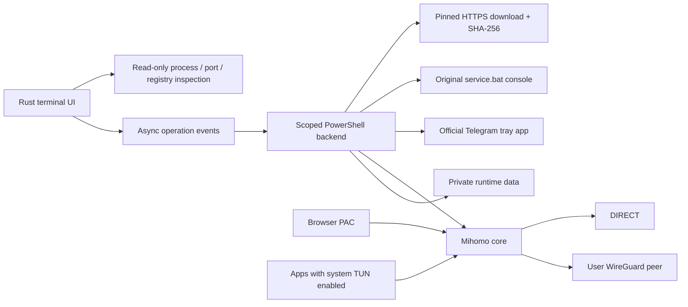

# Architecture

## Runtime contract v1

The executable locates assets beside itself (or an explicit `--assets`). Mutable
state uses `--root`, then `URT_HOME`, then `%LOCALAPPDATA%\URT`. There is no legacy
installation fallback. Settings have `schema_version: 1`, selected YAML, saved
profile paths, Mihomo port and Telegram port. Private settings are atomically
replaced and protected with Windows ACLs. Profiles never enter the source tree
as a development migration step.

Status polling reads processes, PID records, loopback listeners and the current
user's Windows proxy. A listener alone does not prove service ownership or
internet reachability. Process records include PID, executable path and creation
time; mutation requires all three to match. Quitting the dashboard does not stop
managed components. Tests use independent random local ports with TUN disabled.

## Asynchronous operations and rendering

Backend milestones use `URT_PROGRESS|percent|description`; success is reported
only after the process exits successfully. Unknown progress uses an indeterminate
indicator. Diagnostic completion counts both HTTP replies and transport failures,
while HTTP success is a separate count. HTTP elapsed time is not ICMP RTT.

Ratatui layouts reserve fixed navigation/footer heights and adapt the body.
Padding is one cell horizontally inside rounded panels. Tables compute a visible
slice around the selected row, with scrollbars positioned by viewport offset.
Unicode labels are truncated by display width, without leaking heap allocations.
Small windows show an explicit resize hint.

## Routing and dependency boundaries

The importer accepts a constrained single-peer WireGuard format and produces
private Mihomo YAML. Arbitrary YAML remains under its owner's control. Provider
paths resolve against the runtime `mihomo-data` home; absolute external paths
work. No IDE, adapter-metric, firewall or global shell-environment synchronization
is performed. Running Mihomo records include the original listening port;
selecting another profile does not redirect diagnostics to its future port.
Enabling Windows Proxy requires the selection to match the running core,
snapshots the original values and restores them only while all applied proxy
values still match the recorded ownership state.

Browser PAC rules are independent from optional process rules. The generated
Mihomo domain union includes browser VPN suffixes, so selected PAC requests can
reach WG. The browser's remaining sites use its system path. An arbitrary system
TUN or external application can influence that path; URT does not assert otherwise.

Zapret strategy selection is delegated to its upstream service manager. Telegram
uses upstream portable configuration, random secrets and upstream single-instance
behavior. These third-party tools keep their own licenses and update lifecycle.
